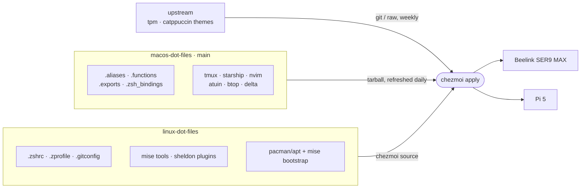

<div align="center">

# linux dot files

**The macOS terminal on Arch Linux and Raspberry Pi OS, set up with one command per machine**


[Quick start](#quick-start) · [How it works](#how-it-works) · [What lives where](#what-lives-where) · [Tools](#tools) · [Daily use](#daily-use)

</div>

---

## What you get


This is the same shell as [macos-dot-files](https://github.com/seifscape/macos-dot-files): Zsh
with Sheldon, a Catppuccin Starship prompt, tmux with TPM, LazyVim, Atuin history, and the
modern CLI replacements (`eza`, `bat`, `delta`, `zoxide`, `fzf`, `btop` and more). It runs on
two machines:

| Machine | OS | CPU | RAM | Storage | Arch |
|---------|----|-----|-----|---------|------|
| Beelink SER9 MAX | Arch Linux | Ryzen AI 7 350 (Radeon 860M) | 32 GB DDR5 | 1 TB NVMe | `x86_64` |
| Raspberry Pi 5 | Raspberry Pi OS (64-bit) | Cortex-A76 | 8 GB | 2 TB NVMe | `arm64` |

The screenshot shows the Mac. Over SSH from Ghostty the servers look the same, because the
Mac renders the fonts and colours.

---

## Quick start

On a fresh Arch or Raspberry Pi OS (64-bit, Debian 13 "trixie" based) install, run:

```bash
sh -c "$(curl -fsLS get.chezmoi.io)" -- -b ~/.local/bin init --apply seifscape/linux-dot-files
```

That command does five things:

| Step | What happens | Where |
|:----:|--------------|-------|
| 1 | Asks for your git name and email, which are stored locally and never committed, and the machine role: `dev` (default on Arch) or `server` (default elsewhere) | [`.chezmoi.toml.tmpl`](home/.chezmoi.toml.tmpl) |
| 2 | Installs zsh, tmux, git and build tools with pacman (Arch) or apt (Raspberry Pi OS), and makes zsh the login shell | [`run_once_before_10-base-packages.sh`](home/.chezmoiscripts/run_once_before_10-base-packages.sh) |
| 3 | Installs [mise](https://mise.jdx.dev) into `~/.local/bin` | [`run_once_before_20-install-mise.sh`](home/.chezmoiscripts/run_once_before_20-install-mise.sh) |
| 4 | Writes the dotfiles and pulls the shared ones from macos-dot-files | [`.chezmoiexternal.toml.tmpl`](home/.chezmoiexternal.toml.tmpl) |
| 5 | Runs `mise install`, `sheldon lock` and `bat cache --build` | [`run_onchange_after_30-mise-install.sh.tmpl`](home/.chezmoiscripts/run_onchange_after_30-mise-install.sh.tmpl) |

Then finish two things by hand:

```bash
exit                 # log back in so zsh becomes your shell
tmux                 # then press prefix + I to install tmux plugins
```

> [!WARNING]
> Use a trixie-based Raspberry Pi OS. On a Debian 12 "bookworm" image, atuin's prebuilt
> binary needs glibc 2.38+ and fails at every shell start (bookworm ships 2.36).

> [!TIP]
> Unauthenticated GitHub API calls are capped at 60 per hour, and a `dev` machine has 30 tools
> to resolve (a `server` has 24). If `mise install` stops on a rate limit, `export GITHUB_TOKEN=…` and run
> `chezmoi apply` again.

---

## How it works

This repo holds **only the files that have to differ on Linux**. Everything else comes straight
from macos-dot-files as a [chezmoi external](https://www.chezmoi.io/reference/special-files/chezmoiexternal-format/).
Each shared file has one real copy, and nothing has to be synced by hand.



Edit a shared file on the Mac and push it. The next `chezmoi update` on each server picks it up.

---

## What lives where

### Linux only (in this repo)

| File | How it differs from the Mac |
|------|-----------------------------|
| [`.zshrc`](home/dot_zshrc) | Runs `mise activate` first, because mise provides sheldon, zoxide, atuin and starship here; activates fnox and aube only where they're installed |
| [`.zprofile`](home/dot_zprofile) | Puts mise shims on `PATH` instead of running `brew shellenv`; no OrbStack or VS Code |
| [`.zshenv`](home/dot_zshenv) | Puts `~/.local/bin` on `PATH`, where mise installs itself |
| [`.gitconfig`](home/dot_gitconfig) | Leaves out the Sourcetree difftool and Git Credential Manager |
| [`.gitconfig.local`](home/create_dot_gitconfig.local.tmpl) | Created once from your `init` answers, then left alone |
| [`mise/config.toml`](home/dot_config/mise/config.toml.tmpl) | The CLI tools Homebrew provides on the Mac, plus the Mac's runtimes on a `dev` machine |
| [`sheldon/plugins.toml`](home/dot_config/sheldon/plugins.toml) | Loads fzf with `fzf --zsh` instead of from `/opt/homebrew/opt/fzf` |
| [`.claude/settings.json`](home/dot_claude/modify_settings.json) | Not a copy: merges only the `statusLine` key into Claude Code's own file, so Claude Code shows the `claude-code` profile from `starship.toml`. The Mac's `install.sh` sets the same key with `jq` |

### Shared (pulled from [macos-dot-files](https://github.com/seifscape/macos-dot-files))

| | |
|---|---|
| **Shell** | `.aliases` · `.functions` · `.exports` · `.zsh_bindings` |
| **Terminal** | Ghostty `config` · `.tmux.conf` · `tmux.reset.conf` · `starship.toml` |
| **Editor** | the whole `~/.config/nvim` directory (LazyVim) |
| **Tools** | atuin · btop · delta · gh-dash · `dev-updates.sh` |
| **Git** | `.gitignore_global` |

### Upstream (replaces the Mac's manual clones)

| Target | Source | Refresh |
|--------|--------|---------|
| `~/.tmux/plugins/tpm` | [tmux-plugins/tpm](https://github.com/tmux-plugins/tpm) | weekly |
| `~/.config/delta-themes` | [catppuccin/delta](https://github.com/catppuccin/delta) | weekly |
| `~/.config/bat/themes/` | [catppuccin/bat](https://github.com/catppuccin/bat): Frappé, Latte, Mocha | weekly |

---

## Tools

Debian's apt is missing most of these tools or ships old versions, and mise has native builds
for both architectures, so both machines get them from mise even though Arch's repos have them.

What gets installed depends on the role chosen at `chezmoi init` (stored as `role` in
`~/.config/chezmoi/chezmoi.toml`; machines set up before roles existed default to `dev` on
Arch and `server` elsewhere). To switch, run `chezmoi init` again or edit that file, then
`chezmoi apply`.

| | `dev` (SER9 MAX) | `server` (Pi 5) |
|---|:-:|:-:|
| Terminal tools, including Claude Code | ✅ | ✅ |
| `uv`, `fnox` | ✅ | ✅ |
| python, node, go, zig, rust, aube | ✅ | — |

A server never compiles anything, so the runtimes would only be weekly re-downloads from
`dev-updates.sh`. `uv` still gets you Python on demand (`uv run`, `uv tool install`).

### Runtimes

The same pins as the Mac, with three differences: `ruby` and `tuist` are left out, and
`python.compile` is off because it would build Python from source.

| Tool | Pin | Role | | Tool | Pin | Role |
|------|-----|------|-|------|-----|------|
| uv | `0.11.6` | both | | fnox | `latest` | both |
| python | `3.14.3` | dev | | node | `24.19.0` | dev |
| go | `1.24.2` | dev | | rust | `latest` | dev |
| zig | `0.11.0` | dev | | aube | `latest` | dev |

> [!NOTE]
> On a `server`, the tmux-thumbs hint mode (`prefix + Space`) can't install: it compiles with
> Rust, and its prebuilt binaries are x86_64 only. Pressing it just opens a pane with an
> error. Use copy mode (`prefix + [`), which reaches the Mac clipboard over OSC 52.

### Terminal tools (all `latest`)

```
sheldon   starship  zoxide    atuin     fzf       eza       bat
delta     fd        ripgrep   jq        btop      duf       dust
procs     tealdeer  yazi      fastfetch neovim    lazygit   gh
claude
```

**From pacman / apt:** `zsh` `tmux` `git` `curl` `wget` `tree` `ncdu` `base-devel` / `build-essential`, plus JetBrains Mono Nerd Font, the Mac's Ghostty font, for a local terminal (over SSH the Mac draws the fonts): `ttf-jetbrains-mono-nerd` from pacman on Arch, and the [nerd-fonts release](https://github.com/ryanoasis/nerd-fonts/releases) into `~/.local/share/fonts` on the Pi

---

## Daily use

| Task | Command |
|------|---------|
| Pull changes from both repos | `chezmoi update` |
| Get a Mac-side change right now | `chezmoi apply --refresh-externals` |
| Edit a Linux-only file | `chezmoi edit ~/.zshrc`, then `chezmoi apply` |
| Preview what would change | `chezmoi diff` |
| Upgrade every mise tool | `dev-refresh` |

> [!IMPORTANT]
> Edit shared files **on the Mac**, in macos-dot-files, and push them. If you edit `~/.aliases`
> on a server, the next refresh overwrites it.

To try a Mac branch before merging it, point the externals at that branch:

```bash
chezmoi apply --refresh-externals --override-data '{"macosRef":"my-branch"}'
```

### Keeping shared files portable

Everything listed under *Shared* runs on both systems, so follow these rules when editing on the Mac:

| Instead of | Use |
|------------|-----|
| a macOS-only alias | the `[[ $OSTYPE == darwin* ]]` block at the bottom of `.aliases` |
| `pbcopy` | `clip`, which uses pbcopy on the Mac and OSC 52 over SSH and inside tmux |
| `/Users/seifkobrosly/…` | `$HOME` |
| `stat -f`, `sed -i ''` | `zstat`, or another form that works on both BSD and GNU |

---

## Structure

```
linux-dot-files/
├── .chezmoiroot                       # source lives in home/, which keeps README out of $HOME
└── home/
    ├── .chezmoi.toml.tmpl             # git name/email prompts · macosRef
    ├── .chezmoiexternal.toml.tmpl     # shared files + tpm + catppuccin themes
    ├── .chezmoiscripts/
    │   ├── run_once_before_10-base-packages.sh
    │   ├── run_once_before_20-install-mise.sh
    │   └── run_onchange_after_30-mise-install.sh.tmpl
    ├── .chezmoiremove                 # deletes a local config.ghostty so it can't mix with the shared one
    ├── create_dot_gitconfig.local.tmpl
    ├── dot_gitconfig
    ├── dot_zprofile
    ├── dot_zshenv
    ├── dot_zshrc
    ├── dot_claude/
    │   └── modify_settings.json       # merges statusLine into Claude Code's settings
    └── dot_config/
        ├── mise/config.toml.tmpl      # tool list, by role
        └── sheldon/plugins.toml
```

---

<div align="center">

Companion to [**macos-dot-files**](https://github.com/seifscape/macos-dot-files) · Catppuccin everywhere

</div>
