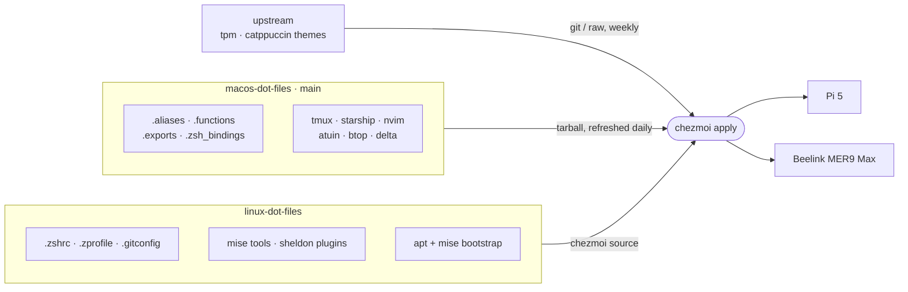

<div align="center">

# linux dot files

**The macOS terminal on Ubuntu Server, set up with one command per machine**


[Quick start](#quick-start) · [How it works](#how-it-works) · [What lives where](#what-lives-where) · [Tools](#tools) · [Daily use](#daily-use)

</div>

---

## What you get


This is the same shell as [macos-dot-files](https://github.com/seifscape/macos-dot-files): Zsh
with Sheldon, a Catppuccin Starship prompt, tmux with TPM, LazyVim, Atuin history, and the
modern CLI replacements (`eza`, `bat`, `delta`, `zoxide`, `fzf`, `btop` and more). It runs on
two headless machines:

| Machine | Arch |
|---------|------|
| Raspberry Pi 5 | `arm64` |
| Beelink MER9 Max | `x86_64` |

The screenshot shows the Mac. Over SSH from Ghostty the servers look the same, because the
Mac renders the fonts and colours.

---

## Quick start

On a fresh Ubuntu Server install, run:

```bash
sh -c "$(curl -fsLS get.chezmoi.io)" -b ~/.local/bin -- init --apply seifscape/linux-dot-files
```

That command does five things:

| Step | What happens | Where |
|:----:|--------------|-------|
| 1 | Asks for your git name and email, which are stored locally and never committed | [`.chezmoi.toml.tmpl`](home/.chezmoi.toml.tmpl) |
| 2 | Installs zsh, tmux, git and build tools with apt, and makes zsh the login shell | [`run_once_before_10-apt-packages.sh`](home/.chezmoiscripts/run_once_before_10-apt-packages.sh) |
| 3 | Installs [mise](https://mise.jdx.dev) into `~/.local/bin` | [`run_once_before_20-install-mise.sh`](home/.chezmoiscripts/run_once_before_20-install-mise.sh) |
| 4 | Writes the dotfiles and pulls the shared ones from macos-dot-files | [`.chezmoiexternal.toml.tmpl`](home/.chezmoiexternal.toml.tmpl) |
| 5 | Runs `mise install`, `sheldon lock` and `bat cache --build` | [`run_onchange_after_30-mise-install.sh.tmpl`](home/.chezmoiscripts/run_onchange_after_30-mise-install.sh.tmpl) |

Then finish two things by hand:

```bash
exit                 # log back in so zsh becomes your shell
tmux                 # then press prefix + I to install tmux plugins
```

> [!TIP]
> Unauthenticated GitHub API calls are capped at 60 per hour, and there are 29 tools to
> resolve. If `mise install` stops on a rate limit, `export GITHUB_TOKEN=…` and run
> `chezmoi apply` again.

---

## How it works

This repo holds **only the files that have to differ on Linux**. Everything else comes straight
from macos-dot-files as a [chezmoi external](https://www.chezmoi.io/reference/special-files/chezmoiexternal-format/).
Each shared file has one real copy, and nothing has to be synced by hand.



Edit a shared file on the Mac and push it. The next `chezmoi update` on each server picks it up.

---

## What lives where

### Linux only (in this repo)

| File | How it differs from the Mac |
|------|-----------------------------|
| [`.zshrc`](home/dot_zshrc) | Runs `mise activate` first, because mise provides sheldon, zoxide, atuin and starship here |
| [`.zprofile`](home/dot_zprofile) | Puts mise shims on `PATH` instead of running `brew shellenv`; no OrbStack or VS Code |
| [`.zshenv`](home/dot_zshenv) | Puts `~/.local/bin` on `PATH`, where mise installs itself |
| [`.gitconfig`](home/dot_gitconfig) | Leaves out the Sourcetree difftool and Git Credential Manager |
| [`.gitconfig.local`](home/create_dot_gitconfig.local.tmpl) | Created once from your `init` answers, then left alone |
| [`mise/config.toml`](home/dot_config/mise/config.toml) | The Mac's runtimes plus the CLI tools Homebrew provides on the Mac |
| [`sheldon/plugins.toml`](home/dot_config/sheldon/plugins.toml) | Loads fzf with `fzf --zsh` instead of from `/opt/homebrew/opt/fzf` |

### Shared (pulled from [macos-dot-files](https://github.com/seifscape/macos-dot-files))

| | |
|---|---|
| **Shell** | `.aliases` · `.functions` · `.exports` · `.zsh_bindings` |
| **Terminal** | `.tmux.conf` · `tmux.reset.conf` · `starship.toml` |
| **Editor** | the whole `~/.config/nvim` directory (LazyVim) |
| **Tools** | atuin · btop · delta · gh-dash · `dev-updates.sh` |
| **Git** | `.gitignore_global` |

### Upstream (replaces the Mac's manual clones)

| Target | Source | Refresh |
|--------|--------|---------|
| `~/.tmux/plugins/tpm` | [tmux-plugins/tpm](https://github.com/tmux-plugins/tpm) | weekly |
| `~/.config/delta-themes` | [catppuccin/delta](https://github.com/catppuccin/delta) | weekly |
| `~/.config/bat/themes/` | [catppuccin/bat](https://github.com/catppuccin/bat): Frappé, Latte, Mocha | weekly |

---

## Tools

Ubuntu's apt is missing most of these tools or ships old versions, and mise has native builds
for both architectures. The runtimes use the same pins as the Mac, with three differences:
`ruby@ios` and `tuist` are left out, and `python.compile` is off because it would build Python
from source on the Pi.

### Runtimes

| Tool | Pin | | Tool | Pin |
|------|-----|-|------|-----|
| python | `3.14.3` | | uv | `0.11.6` |
| node | `24.19.0` | | rust | `latest` |
| go | `1.24.2` | | fnox | `latest` |
| zig | `0.11.0` | | aube | `latest` |

### Terminal tools (all `latest`)

```
sheldon   starship  zoxide    atuin     fzf       eza       bat
delta     fd        ripgrep   jq        btop      duf       dust
procs     tealdeer  yazi      fastfetch neovim    lazygit   gh
```

**From apt:** `zsh` `tmux` `git` `curl` `wget` `tree` `ncdu` `build-essential`

---

## Daily use

| Task | Command |
|------|---------|
| Pull changes from both repos | `chezmoi update` |
| Get a Mac-side change right now | `chezmoi apply --refresh-externals` |
| Edit a Linux-only file | `chezmoi edit ~/.zshrc`, then `chezmoi apply` |
| Preview what would change | `chezmoi diff` |
| Upgrade every mise tool | `dev-refresh` |

> [!IMPORTANT]
> Edit shared files **on the Mac**, in macos-dot-files, and push them. If you edit `~/.aliases`
> on a server, the next refresh overwrites it.

To try a Mac branch before merging it, point the externals at that branch:

```bash
chezmoi apply --refresh-externals --override-data '{"macosRef":"my-branch"}'
```

### Keeping shared files portable

Everything listed under *Shared* runs on both systems, so follow these rules when editing on the Mac:

| Instead of | Use |
|------------|-----|
| a macOS-only alias | the `[[ $OSTYPE == darwin* ]]` block at the bottom of `.aliases` |
| `pbcopy` | `clip`, which uses pbcopy on the Mac and OSC 52 over SSH and inside tmux |
| `/Users/seifkobrosly/…` | `$HOME` |
| `stat -f`, `sed -i ''` | `zstat`, or another form that works on both BSD and GNU |

---

## Structure

```
linux-dot-files/
├── .chezmoiroot                       # source lives in home/, which keeps README out of $HOME
└── home/
    ├── .chezmoi.toml.tmpl             # git name/email prompts · macosRef
    ├── .chezmoiexternal.toml.tmpl     # shared files + tpm + catppuccin themes
    ├── .chezmoiscripts/
    │   ├── run_once_before_10-apt-packages.sh
    │   ├── run_once_before_20-install-mise.sh
    │   └── run_onchange_after_30-mise-install.sh.tmpl
    ├── create_dot_gitconfig.local.tmpl
    ├── dot_gitconfig
    ├── dot_zprofile
    ├── dot_zshenv
    ├── dot_zshrc
    └── dot_config/
        ├── mise/config.toml
        └── sheldon/plugins.toml
```

---

<div align="center">

Companion to [**macos-dot-files**](https://github.com/seifscape/macos-dot-files) · Catppuccin everywhere

</div>
